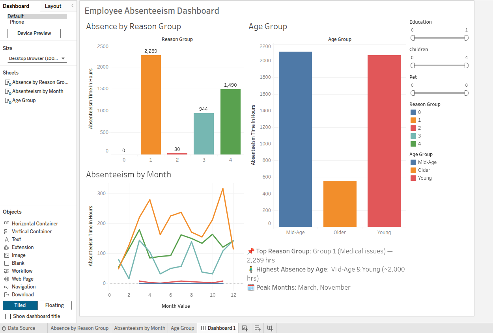

# 🧑‍💼 Employee Absenteeism Analysis

This project explores and predicts employee absenteeism using data analytics and machine learning. Completed as part of the **Google Data Analytics Professional Certificate**, it combines EDA, predictive modeling, and dashboard storytelling in **Python** and **Tableau**.

---

## 🧩 Project Summary

- **🎯 Goal:** Understand key factors driving absenteeism and predict lost work hours.
- **📦 Tools:** Python (pandas, scikit-learn, XGBoost), Tableau Public
- **📊 Techniques:** EDA, feature engineering, regression modeling, dashboarding
- **📁 Dataset:** Simulated HR absenteeism data (via Coursera)

---

## 📸 Dashboard Preview

> 📍 [Click here to view full interactive dashboard](https://public.tableau.com/...)  
> Filters: Education, Children, Pets | Views: Reason Group, Month, Age

---

## 🔍 Key Findings

- **Top Absence Type:** Medical-related (Reason Group 1)
- **Peak Months:** March & November
- **Impactful Features:** Reason Group, Workload, Month, Education
- **Best Model:** Random Forest (R² ≈ 0.46, RMSE ≈ 11.2 hrs)
